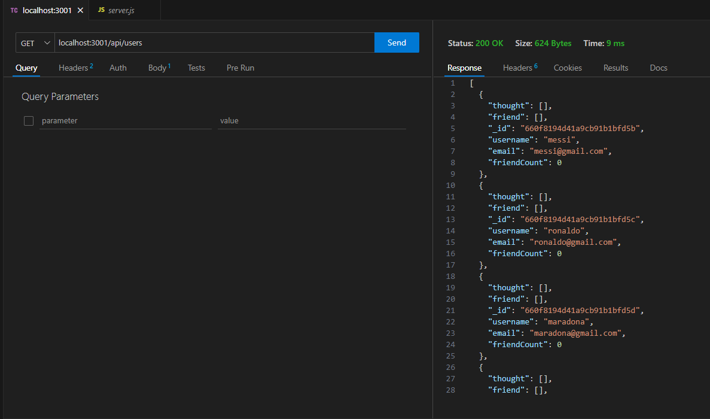
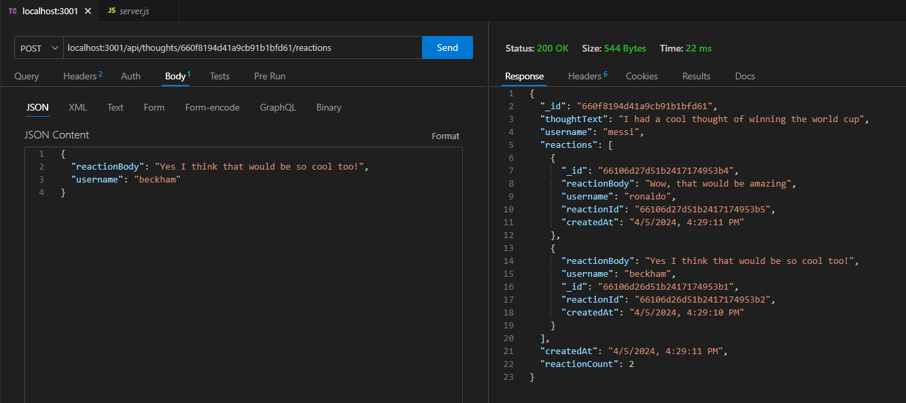

# Social Network API

## Github Repo Link:

https://github.com/FullPersonDev/socialnetworkapi

## Mock Up
This is what the working application looks like

- This shows Get all users
- 

- This shows Post a reaction to a comment
- 

## Instructions
- Download remote repo to local
- In Command Line, within root folder run: npm install
- In Command Line, within root folder run: npm run seed
- In Command Line, within root folder run: npm start
- Then use a service like Insomnia or Thunderclient to interact with the various API routes.